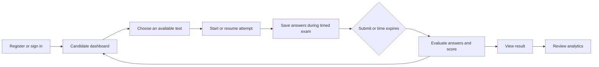

# ExamPlus

ExamPlus is a Django-based online examination platform for managing test series, importing multiple-choice questions, running timed candidate attempts, and reviewing performance. The project is organized as focused Django apps so that account management, assessments, questions, attempts, dashboards, and analytics remain separate concerns.

## Project Highlights

- Custom user model with candidate and admin roles.
- Test series and tests with scheduling, status, duration, difficulty, and scoring configuration.
- Admin-managed question bank with four-option multiple-choice questions.
- Transactional CSV question import with header, value, and row validation.
- Timed attempts that can be resumed, save answers, and submit automatically when time expires.
- Scoring for correct, incorrect, and unanswered questions, including configurable negative marks.
- Candidate dashboard for available tests, upcoming tests, and completed attempts.
- Performance analytics for overall scores, subjects, difficulty levels, and score trends.
- Django admin for managing tests, questions, options, and attempts.

## Technology

- Python
- Django 6.1.1
- SQLite for local development
- Django templates and static CSS
- Bootstrap 5.3.3, loaded from its CDN
- `python-dotenv` for loading a root-level `.env` file

The exact Python dependencies are pinned in [`requirements.txt`](requirements.txt).

## Requirements

- Python compatible with Django 6.1.1
- `pip`
- A terminal (PowerShell on Windows, or a shell on macOS/Linux)

Check that Python and pip are available:

```console
python --version
python -m pip --version
```

## Installation and Local Setup

Run the environment and dependency commands from the repository root, the directory containing `requirements.txt`. Django management commands run from `app/`, the directory containing `manage.py`.

### 1. Create a virtual environment

**Windows PowerShell**

```powershell
python -m venv .venv
```

Activate it:

```powershell
.\.venv\Scripts\Activate.ps1
```

If PowerShell execution policy prevents activation, invoke the environment's interpreter directly, for example `\.venv\Scripts\python.exe -m pip install -r requirements.txt`.

**macOS / Linux**

```bash
python3 -m venv .venv
source .venv/bin/activate
```

### 2. Install dependencies

From the repository root:

```console
python -m pip install --upgrade pip
python -m pip install -r requirements.txt
```

The requirements file installs the pinned Django version and the project's other dependencies. For a standalone Django installation, the pinned framework can also be installed with `python -m pip install Django==6.1.1`; for this project, prefer installing the complete requirements file.

### 3. Apply database migrations

```console
cd app
python manage.py migrate
```

The development database uses SQLite and is created at `app/db.sqlite3` when needed.

### 4. Create an administrator

```console
python manage.py createsuperuser
```

The superuser can access Django admin and the administrator-protected question import flow.

### 5. Start the development server

```console
python manage.py runserver
```

Open [http://127.0.0.1:8000/](http://127.0.0.1:8000/) in a browser. The admin site is available at [http://127.0.0.1:8000/admin/](http://127.0.0.1:8000/admin/).

To stop the development server, press `Ctrl+C` in the terminal.

## First Exam Setup

1. Sign in to `/admin/` with the superuser created above.
2. Create a **Test series**.
3. Create a **Test** in that series. Set its duration and scoring values, and set its status to **Published** and active when it is ready for candidates.
4. Import questions using `/questions/tests/<test_id>/import/`, replacing `<test_id>` with the test's database ID. The import view is restricted to staff users or users with the `ADMIN` role.
5. Use the supplied [`test_questions.csv`](test_questions.csv) as a sample import file.
6. Register a candidate at `/accounts/register/`, sign in, and open `/dashboard/` to start an available test.

Tests with a future scheduled date or start time are shown as upcoming. A test must be published, active, and contain questions before an attempt can start.

## CSV Import Format

The importer expects a UTF-8 CSV file with these headers:

```csv
question_number,question,option_a,option_b,option_c,option_d,correct_option,explanation,subject,topic,difficulty,marks,negative_marks
```

`question_number` must be a positive integer. `correct_option` must be `A`, `B`, `C`, or `D`; `difficulty` must be `EASY`, `MEDIUM`, or `HARD`. Question text, all four options, marks, and negative marks are required. The importer validates the file and writes each import transactionally, so a validation error does not leave a partial import.

## Candidate and Scoring Flow



Correct answers earn the question's marks, incorrect answers deduct its negative marks, and unanswered questions receive zero. Results include the score, percentage, accuracy, answer counts, and time taken. Candidates can review completed attempts from the dashboard and view aggregate performance at `/analytics/`.

## Application Routes

| URL | Purpose | Access |
| --- | --- | --- |
| `/` | Home page | Public |
| `/about/` | About page | Public |
| `/accounts/register/` | Candidate registration | Public |
| `/accounts/login/` | Sign in | Public |
| `/accounts/logout/` | Sign out | Signed-in user |
| `/admin/` | Django administration | Staff user |
| `/dashboard/` | Available, upcoming, and previous tests | Signed-in user |
| `/questions/tests/<test_id>/import/` | Import a test's questions from CSV | Staff or `ADMIN` role |
| `/attempts/tests/<test_id>/start/` | Start or resume a test attempt | Signed-in user |
| `/attempts/<attempt_id>/` | Take an in-progress test | Attempt owner |
| `/attempts/<attempt_id>/answer/` | Save an answer | Attempt owner |
| `/attempts/<attempt_id>/submit/` | Submit an attempt | Attempt owner |
| `/attempts/<attempt_id>/result/` | View an attempt result | Attempt owner |
| `/analytics/` | Candidate performance analytics | Signed-in user |

## Repository Structure

```text
ExamPlus/
├── README.md
├── requirements.txt                 # Pinned Python dependencies
├── test_questions.csv                # Sample question-import file
└── app/
    ├── manage.py                     # Django management entry point
    ├── db.sqlite3                    # Local database, created by migrations
    ├── app/                          # Django project configuration
    │   ├── settings.py               # Installed apps, database, templates, static files
    │   ├── urls.py                   # Root URL routing
    │   ├── asgi.py                   # ASGI application entry point
    │   ├── wsgi.py                   # WSGI application entry point
    │   └── static/
    │       └── css/style.css         # Project styles
    ├── accounts/                     # Custom user, registration, authentication
    │   ├── models.py
    │   ├── forms.py
    │   ├── views.py
    │   ├── urls.py
    │   ├── admin.py
    │   ├── tests.py
    │   ├── migrations/
    │   └── templates/accounts/
    │       ├── login.html
    │       └── register.html
    ├── exam_tests/                   # Test series and exam definitions
    │   ├── models.py
    │   ├── admin.py
    │   ├── views.py
    │   ├── tests.py
    │   └── migrations/
    ├── questions/                    # Questions, options, and CSV import
    │   ├── models.py
    │   ├── forms.py
    │   ├── views.py
    │   ├── urls.py
    │   ├── admin.py
    │   ├── tests.py
    │   ├── migrations/
    │   ├── services/csv_importer.py  # CSV parsing, validation, and persistence
    │   └── templates/questions/
    │       └── csv_import.html
    ├── attempts/                     # Timed candidate attempts and answer handling
    │   ├── models.py
    │   ├── views.py
    │   ├── urls.py
    │   ├── admin.py
    │   ├── tests.py
    │   ├── migrations/
    │   ├── services/attempt_service.py
    │   ├── services/scoring.py
    │   └── templates/attempts/
    │       ├── exam.html
    │       └── result.html
    ├── analytics/                    # Candidate performance summaries
    │   ├── models.py
    │   ├── views.py
    │   ├── urls.py
    │   ├── admin.py
    │   ├── tests.py
    │   ├── migrations/
    │   ├── services/performance.py
    │   └── templates/analytics/
    │       └── dashboard.html
    ├── dashboard/                    # Candidate home and test listings
    │   ├── views.py
    │   ├── urls.py
    │   ├── tests.py
    │   ├── migrations/
    │   └── templates/dashboard/
    │       └── candidate_dashboard.html
    ├── core/                         # Shared access-control mixins
    │   ├── mixins.py
    │   ├── models.py
    │   ├── tests.py
    │   └── migrations/
    ├── pages/                        # Public home and about pages
    │   ├── views.py
    │   ├── urls.py
    │   ├── tests.py
    │   ├── migrations/
    │   └── templates/pages/
    │       ├── home.html
    │       └── about.html
    └── templates/                    # Shared site templates
        ├── base.html
        ├── navbar.html
        └── footer.html
```

Each Django app owns its models, views, routes, migrations, and tests where applicable. Reusable business logic is kept in `services/` modules, while app-specific templates live alongside the app and shared layout templates live under `app/templates/`.

## Development Commands

Run these commands from `app/` with the virtual environment active:

```console
python manage.py check
python manage.py test
python manage.py makemigrations
python manage.py migrate
```

Use `makemigrations` after changing models, inspect the generated migration, and commit intentional migration files. The existing `tests.py` files are currently scaffolding; add focused tests for authentication, CSV validation, attempt timing, scoring, and analytics as those workflows evolve.

## Configuration and Production Readiness

This repository is configured for local development, not production deployment. The current settings use SQLite, enable `DEBUG`, leave `ALLOWED_HOSTS` empty, and contain a development `SECRET_KEY` in source. Although a root-level `.env` file is loaded, the current `SECRET_KEY` and `DEBUG` settings are not read from environment variables. Do not deploy these settings or publish a real secret.

Before production, move secrets and environment-specific settings out of source control; disable debug mode; configure allowed hosts, HTTPS, secure cookies, and a production database; configure static-file collection and serving; and use a production WSGI/ASGI server. Review Django's deployment checklist for the target hosting environment.

## License

No license file is currently included. Add a license before redistributing this project or accepting external contributions.